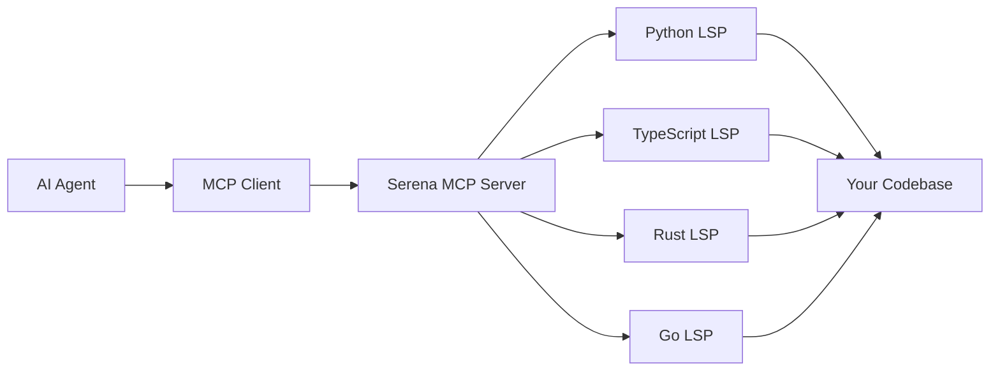

I asked an AI agent to refactor a class that inherits from `AbstractSecurity.ts`. The agent searched for "authentication" using vector embeddings, retrieved `Auth.ts` (which mentions "authentication" 47 times), and completely missed the base class (which mentions it zero times).

**Not because the model was dumb.** Because we gave it the wrong eyes.

Vector search treats code like prose—fuzzy, semantic, probabilistic. But code isn't prose. **Code is a hyper-structured graph** of dependencies, inheritance chains, and symbol references. When you navigate with semantics instead of structure, you get hallucinations, partial refactors, and broken builds.

Serena MCP solves this by giving AI agents what human developers have had for decades: **Language Server Protocol (LSP) vision**. The same symbolic, deterministic code understanding that powers "Go to Definition" in VS Code, now available to AI agents through the Model Context Protocol.

This isn't incremental improvement. **This is architectural transformation.**

## The Fundamental Flaw: Why RAG Fails at Code

The industry standard for AI coding assistants is Retrieval-Augmented Generation (RAG) with vector embeddings. Chunk your code, embed it into high-dimensional vectors, store it in Pinecone or Milvus, and retrieve by cosine similarity.

**The failure modes are structural:**

<Comparison
  title="Vector Search vs Symbolic Navigation"
  wrong="Vector embeddings retrieve semantically similar text chunks based on cosine similarity. The base class AbstractSecurity mentions 'authentication' zero times, so it never gets retrieved."
  right="LSP follows the inheritance graph deterministically. textDocument/definition returns the exact location of the parent class, regardless of semantic similarity."
  language="text"
/>

### The Three Deadly Problems

**1. Semantic Ambiguity**

A file named `Auth.ts` might mention "authentication" constantly, but the actual logic lives in a base class that never mentions the keyword. Vector search retrieves the wrong file. The agent hallucinates imports.

**2. Lack of Precision**

Code is **fragile**. Changing a function signature impacts every call site. Vector search is fuzzy—it cannot guarantee finding all references. You get partial refactors that break the build.

<Icon name="AlertCircle" size={16} className="text-primary" /> **Real example:** Agent renamed
`processPayment()` in the service class but missed 4 call sites in the controller layer. Production
down for 2 hours.

**3. Token Inefficiency**

To compensate for inaccuracy, RAG systems retrieve massive chunks of code. You flood the context window with irrelevant data, diluting the model's attention and burning tokens.

<Comparison
  title="Token Economy: RAG vs LSP"
  wrong="Vector search retrieves 5 files (15,000 tokens) hoping one contains the right function. Agent reads all 5 to find the target."
  right="LSP issues textDocument/definition, returns exact file and line range. Agent reads only the 200-token function body."
  language="text"
/>

**Users report 70% token savings** after switching from RAG to Serena.

## Enter LSP: The Language of Compilers

The Language Server Protocol was created by Microsoft for VS Code. It's a standardized JSON-RPC protocol that allows a client (your editor) to ask a server (the language analyzer) **precise, structured questions** about code.

When you right-click a function and select "Go to Definition," VS Code doesn't search for the text of the function name. It issues an LSP command: `textDocument/definition`. The Language Server, having parsed the Abstract Syntax Tree (AST) of your entire project, returns the **exact file location and range** of that symbol's definition.

<Terminal
  title="LSP in Action: Deterministic Symbol Resolution"
  lines={[
    {
      type: 'input',
      prompt: 'LSP>',
      content: 'textDocument/definition for "processPayment"',
    },
    {
      type: 'output',
      content: 'Parsing AST and symbol table...',
    },
    {
      type: 'success',
      content: '✓ Found: src/services/payment.service.ts:45-62',
    },
    {
      type: 'output',
      content: 'Type: MethodDeclaration',
    },
    {
      type: 'output',
      content: 'Scope: PaymentService class',
    },
    {
      type: 'success',
      content: '✓ 100% precision, 0 false positives',
    },
  ]}
/>

**The implications for AI agents:**

- <Icon name="Target" size={16} className="text-primary" /> **Determinism**: No more guessing. The
  agent navigates a precise map of the code.
- <Icon name="Zap" size={16} className="text-primary" /> **Token Economy**: Read only what you need.
  500 tokens instead of 5,000.
- <Icon name="Brain" size={16} className="text-primary" /> **Structure Awareness**: Query type
  hierarchies ("What classes inherit from Controller?") for architectural refactoring that text
  search can't support.

## Serena MCP: The LSP Bridge for AI Agents

Serena is an **MCP Server** that wraps the Language Server Protocol and exposes it to AI agents through the Model Context Protocol.

Think of MCP as **the USB-C of AI tooling**. Just as USB-C lets any peripheral connect to any computer, MCP lets Serena plug into any AI agent—Claude Desktop, Claude Code, Cursor, VS Code, custom terminal agents—without the agent needing to know how to run a Java Language Server or parse Python ASTs.

### Architecture: Decoupled Intelligence



**The genius of this design:**

1. **Polyglot by default**: Serena manages a fleet of language-specific LSP servers. Add a Rust file to your Python monorepo? Serena spins up `rust-analyzer` automatically.
2. **Agent-agnostic**: The same Serena instance works with Claude, Cursor, and custom agents. Switch clients without reconfiguring.
3. **Persistent memory**: Serena maintains Markdown memories about your project. The agent "learns" your architecture over time.

| Feature          | Vector RAG            | Serena MCP (LSP)                  |
| ---------------- | --------------------- | --------------------------------- |
| **Indexing**     | Semantic embeddings   | Abstract Syntax Trees             |
| **Precision**    | Fuzzy (probabilistic) | Exact (deterministic)             |
| **Dependencies** | Weak (text proximity) | Strong (call graphs, inheritance) |
| **Token Usage**  | High (large chunks)   | Low (symbol bodies only)          |
| **Edits**        | Full-file overwrites  | Surgical symbol replacement       |
| **Failure Mode** | Hallucinated imports  | Timeout on broken codebases       |

## Installation: The Right Way

Serena is managed by **uv**, a next-gen Python package manager written in Rust. Unlike `pip`, `uv` creates ephemeral, isolated environments—no dependency conflicts with your host system.

### Install uv First

<Terminal
  title="Install uv (Rust-based Python package manager)"
  lines={[
    {
      type: 'comment',
      content: '// Linux/macOS',
    },
    {
      type: 'input',
      prompt: '$',
      content: 'curl -LsSf https://astral.sh/uv/install.sh | sh',
    },
    {
      type: 'comment',
      content: '// Windows (PowerShell)',
    },
    {
      type: 'input',
      prompt: 'PS>',
      content: 'irm https://astral.sh/uv/install.ps1 | iex',
    },
  ]}
/>

### Method A: Stdio Transport (Local)

This is the standard deployment for local clients like Claude Desktop or VS Code. The client spawns Serena as a subprocess and communicates via stdio.

<Terminal
  title="Run Serena Locally"
  lines={[
    {
      type: 'input',
      prompt: '$',
      content: 'uvx --from git+https://github.com/oraios/serena serena start-mcp-server',
    },
    {
      type: 'output',
      content: 'Pulling latest from GitHub main branch...',
    },
    {
      type: 'success',
      content: '✓ Serena MCP server started on stdio',
    },
    {
      type: 'output',
      content: 'Waiting for client connection...',
    },
  ]}
/>

<Icon name="Lightbulb" size={16} className="text-primary" /> **Why `--from git+...`?** Serena's
development velocity is **daily commits**. Pulling from the GitHub main branch ensures you get the
latest LSP fixes. The PyPI release is often weeks behind.

### Method B: SSE Transport (Remote/Docker)

Server-Sent Events (SSE) allows Serena to run as a standalone HTTP server. Use this for:

- **Dockerized setups**: Server in container, client on host
- **Remote development**: Code on cloud instance, client local
- **Multi-agent swarms**: Multiple agents querying one Serena instance

<Terminal
  title="Run Serena as HTTP Server"
  lines={[
    {
      type: 'input',
      prompt: '$',
      content: 'uv run serena start-mcp-server --transport sse --port 9121',
    },
    {
      type: 'success',
      content: '✓ Serena listening on http://localhost:9121/sse',
    },
    {
      type: 'output',
      content: 'Accepting connections from MCP clients...',
    },
  ]}
/>

### Docker: The Enterprise Setup

For monorepos with complex dependencies (Go, Rust, Java simultaneously), Docker provides a reproducible clean room.

```yaml
services:
  serena:
    image: python:3.11-slim
    working_dir: /app
    volumes:
      - ./:/app # CRITICAL: Mount your codebase
      - serena_data:/root/.serena # Persist memories
    environment:
      - PYTHONPATH=/app
      - ENABLE_TOOL_SEARCH=true
    command: >
      bash -c "apt-get update && apt-get install -y git curl &&
      pip install uv &&
      uvx --from git+https://github.com/oraios/serena serena start-mcp-server --transport sse --port 8001"
    ports:
      - '8001:8001'
```

<Icon name="AlertCircle" size={16} className="text-primary" /> **Critical gotcha:** The Docker image
must contain compilers/interpreters for your languages. A "slim" Python image **cannot analyze Rust
code** unless `rustc` is installed in the container.

## Configuration: The Power User's Arsenal

Serena uses a **dual-layer configuration system**: global settings for the user, project-specific settings for each codebase.

### Global Config: `~/.serena/serena_config.yml`

This dictates default behavior across all projects.

```yaml
# Choose between LSP (headless binaries) or JetBrains (IntelliJ/PyCharm)
language_backend: LSP

# Enable experimental features
enable_memory_system: true

# Exclude tools for safety (optional)
excluded_tools:
  - execute_shell_command
```

<Icon name="Brain" size={16} className="text-primary" /> **Expert tip:** The **JetBrains backend**
delegates analysis to a running IntelliJ/PyCharm instance. For Java/Kotlin ecosystems, this is
**significantly more powerful** than the open-source Eclipse JDT server—JetBrains' proprietary
indexes are superior. But it requires the IDE to be open.

### Project Config: `.serena/project.yml`

Created when you activate a project. This is your **mission control**.

<FileTree
  items={[
    {
      id: '1',
      name: '.serena/',
      type: 'folder',
      children: [
        { id: '2', name: 'project.yml', type: 'file' },
        {
          id: '3',
          name: 'memories/',
          type: 'folder',
          children: [
            { id: '4', name: 'Auth_Architecture.md', type: 'file' },
            { id: '5', name: 'Coding_Standards.md', type: 'file' },
          ],
        },
      ],
    },
  ]}
/>

```yaml
project_name: payment-service-v2
language:
  - python
  - typescript
  - rust # Explicitly list all languages for proper LSP startup

ignored_paths:
  - '**/node_modules/**'
  - '**/dist/**'
  - '**/target/**'
  - '**/*.log'
  - '**/Assets/Textures/**' # Game dev: exclude massive 3D assets

read_only: false # Set true for audits or pure exploration

ls_specific_settings:
  csharp:
    runtime_dependencies:
      - id: 'CSharpLanguageServer'
        url: 'https://internal-mirror.corp/roslyn.nupkg'
```

<Icon name="Zap" size={16} className="text-primary" /> **Critical for performance:** In large
monorepos (especially game development or data science), repositories contain **gigabytes of
non-code assets**. If Serena crawls these, `find_file` will timeout. **Aggressively prune** the
search space with `ignored_paths`.

## The Toolset: 18 Surgical Instruments

Serena exposes ~18 tools that constitute the "hands" of the agent. Understanding these is essential for expert usage.

### Navigation & Retrieval

**`find_symbol`**: The primary navigator

<ToolCall
  tool="mcp__serena__find_symbol"
  description="Find a symbol by name across the entire codebase"
  params={{
    name: 'processPayment',
  }}
  result={{
    status: 'success',
    data: {
      file: 'src/services/payment.service.ts',
      line: 45,
      type: 'MethodDeclaration',
      scope: 'PaymentService',
    },
  }}
/>

**Benefit:** 100% precision. No false positives.

**`find_referencing_symbols`**: The refactoring engine

Input: `symbol_name`, `declaration_file`
Output: Every location in the codebase where the symbol is invoked

<Icon name="Target" size={16} className="text-primary" /> **Use case:** "I'm renaming
`processPayment`. Find all 37 call sites so I can update them systematically."

**`get_symbols_overview`**: The map maker

Returns a **skeletal outline** of a file—classes, methods, signatures—without implementation details.

<Comparison
  title="Token Efficiency: Full Read vs Overview"
  wrong="Read entire 500-line file (3,500 tokens) to check if it contains the class you need"
  right="Get symbols overview (200 tokens), verify it's the right file, THEN read specific symbols"
  language="text"
/>

**Strategic value:** Extremely token-efficient. Agents scan the outline to verify they have the right file before committing to reading full content.

### Surgical Editing

**`replace_symbol_body`**: The precision scalpel

Replaces the implementation of a specific function or class **while preserving surrounding context**. No risk of accidentally deleting imports or other functions.

<ToolCall
  tool="mcp__serena__replace_symbol_body"
  description="Replace just the method body, leave everything else intact"
  params={{
    relative_path: 'src/services/user.service.ts',
    symbol_name_path: 'UserService/findOne',
    new_body:
      'async findOne(id: string): Promise<User> {\n  return this.repository.findOneOrFail({ where: { id } });\n}',
  }}
  result={{
    status: 'success',
    message: 'Symbol replaced. Imports, other methods untouched.',
  }}
/>

**`insert_after_symbol`**: Append new code

Inserts code immediately following a target symbol. Perfect for adding new methods to a class or new route handlers.

### The Memory System

Serena has **persistent long-term memory** stored as Markdown files in `.serena/memories/`. The agent "learns" about your project over time.

<Terminal
  title="Agent Writes Memory After Analysis"
  lines={[
    {
      type: 'output',
      content: 'Analyzing authentication flow...',
    },
    {
      type: 'output',
      content: 'Tracing JWTService → AuthMiddleware → AuthController',
    },
    {
      type: 'success',
      content: '✓ Analysis complete. Writing memory...',
    },
    {
      type: 'output',
      content: 'Created: .serena/memories/Auth_Architecture.md',
    },
    {
      type: 'comment',
      content: '// Memory: "Authentication uses JWTs signed by legacy key service, NOT Auth0"',
    },
  ]}
/>

<Icon name="Lightbulb" size={16} className="text-primary" /> **Expert strategy:** Humans can (and
should) **edit these files**. Create a `Coding_Standards.md` with instructions like "Always use TDD"
or "Prefer functional components." You've just **prompted the agent at the project level**,
enforcing consistency across sessions.

### Meta-Cognitive Tools

**`think_about_task_adherence`**: Forces the model to pause and evaluate if its current plan matches the user's original request.

**`think_about_collected_information`**: Synthesizes data from multiple files before proposing a solution.

These prevent "rabbit holes" where the agent dives deep into irrelevant code.

## Integration: The Dream Team with Claude Code

The integration of Serena with **Claude Code** (Anthropic's terminal-based coding agent) represents the current pinnacle of AI-assisted development.

Claude Code provides high-level reasoning and orchestration.
Serena provides low-level, precise "X-ray vision" into code.

### Setup: Connect Claude Code to Serena

<Terminal
  title="Add Serena to Claude Code"
  lines={[
    {
      type: 'input',
      prompt: '$',
      content:
        'claude mcp add serena -- uvx --from git+https://github.com/oraios/serena serena start-mcp-server --context claude-code --project "$(pwd)"',
    },
    {
      type: 'success',
      content: '✓ Serena registered with Claude Code',
    },
    {
      type: 'output',
      content: 'Context: claude-code (optimized for CLI)',
    },
    {
      type: 'output',
      content: 'Project: /Users/you/projects/payment-service',
    },
  ]}
/>

<Icon name="AlertCircle" size={16} className="text-primary" /> **Critical flag:** `--context
claude-code` tailors tool descriptions specifically for the CLI. Using the wrong context
(`ide-assistant`) can lead to tools not appearing or the model hallucinating capabilities.

### The ENABLE_TOOL_SEARCH Paradigm

**The problem:** Serena exposes ~18 complex tools. Loading all tool definitions into the context window at startup consumes **>28,000 tokens** (14% of the window) before you type a single word.

**The solution:** Tool Search (Lazy Loading)

Set the environment variable `ENABLE_TOOL_SEARCH=true`. Instead of loading 18 tool definitions, Claude Code loads a single "Search" tool. When the model reasons "I need to find a symbol," it executes a search for "symbol tools," and the system retrieves only relevant tool definitions (`find_symbol`, `get_symbols_overview`) into context.

<Comparison
  title="Context Window: Tool Loading Strategy"
  wrong="Load all 18 tools at startup: 28,000 tokens burned before conversation starts. Short session history."
  right="Load tools on-demand: Search → retrieve → load. Drastically reduces startup cost. Longer conversations."
  language="text"
/>

**Configuration:**

<Terminal
  title="Enable Tool Search"
  lines={[
    {
      type: 'comment',
      content: '// Linux/macOS: Add to ~/.bashrc or ~/.zshrc',
    },
    {
      type: 'input',
      prompt: '$',
      content: 'export ENABLE_TOOL_SEARCH=true',
    },
    {
      type: 'comment',
      content: '// Windows PowerShell: Add to $PROFILE',
    },
    {
      type: 'input',
      prompt: 'PS>',
      content: '$env:ENABLE_TOOL_SEARCH = "true"',
    },
    {
      type: 'divider',
    },
    {
      type: 'comment',
      content: '// Verify in Claude Code',
    },
    {
      type: 'input',
      prompt: 'claude>',
      content: '/context',
    },
    {
      type: 'success',
      content: '✓ MCP tools: loaded on-demand',
    },
  ]}
/>

## Operational Workflow: Zero to Expert

Mastering Serena isn't just installation—it's adopting a new workflow.

### Phase 1: Onboarding and Memory Seeding

When Serena is first initialized, it triggers the **onboarding tool**.

<Terminal
  title="First Connection: Automatic Onboarding"
  lines={[
    {
      type: 'output',
      content: 'Serena initializing in new project...',
    },
    {
      type: 'output',
      content: 'Crawling file structure...',
    },
    {
      type: 'output',
      content: 'Reading package.json, README.md, Cargo.toml...',
    },
    {
      type: 'output',
      content: 'Identified tech stack: TypeScript, React, Prisma',
    },
    {
      type: 'success',
      content: '✓ Generated memories: Project_Structure.md, Tech_Stack.md',
    },
    {
      type: 'comment',
      content: '// Token-heavy process. Start NEW conversation after onboarding.',
    },
  ]}
/>

<Icon name="Lightbulb" size={16} className="text-primary" /> **Expert tip:** Onboarding is
token-heavy. Once it completes, **start a new conversation**. The memories are persisted on disk.
The new conversation reads the summary memories without carrying the baggage of the initial crawl.

### Phase 2: Indexing for Speed

For projects larger than a few files, "lazy" LSP analysis can be slow. **Force an index**.

<Terminal
  title="Force Full Index (Critical for Monorepos)"
  lines={[
    {
      type: 'input',
      prompt: '$',
      content: 'uvx --from git+https://github.com/oraios/serena serena project index',
    },
    {
      type: 'output',
      content: 'Building complete symbol table...',
    },
    {
      type: 'output',
      content: 'Parsing 1,247 files across 4 languages...',
    },
    {
      type: 'success',
      content: '✓ Index complete. find_symbol latency: 5s → 500ms',
    },
  ]}
/>

**Benefit:** Reduces `find_symbol` latency from ~5 seconds to under 500ms. In monorepos, this is the difference between usable and unusable.

### Phase 3: The Think-Act-Verify Loop

An expert workflow leverages Serena's **meta-cognitive tools** to prevent errors.

**Scenario:** Refactor a class in a monorepo

<Terminal
  title="Expert Workflow: Systematic Refactoring"
  lines={[
    {
      type: 'input',
      prompt: 'user>',
      content: 'Refactor UserSession to use the new RedisCache interface. Plan your steps.',
    },
    {
      type: 'divider',
    },
    {
      type: 'comment',
      content: '// Agent: Think about task adherence',
    },
    {
      type: 'output',
      content: 'Task: Refactor UserSession. First, map out all usage.',
    },
    {
      type: 'divider',
    },
    {
      type: 'comment',
      content: '// Agent: Find all references',
    },
    {
      type: 'output',
      content: 'Using find_referencing_symbols on UserSession...',
    },
    {
      type: 'success',
      content: '✓ Found 15 occurrences across backend + frontend',
    },
    {
      type: 'divider',
    },
    {
      type: 'comment',
      content: '// Agent: Write plan to memory',
    },
    {
      type: 'success',
      content: '✓ Updated memory: Todo_List.md with 15 locations',
    },
    {
      type: 'divider',
    },
    {
      type: 'comment',
      content: '// Agent: Surgical edits',
    },
    {
      type: 'output',
      content: 'Editing 1/15: backend/services/auth.service.ts',
    },
    {
      type: 'output',
      content: 'Editing 2/15: backend/controllers/session.controller.ts',
    },
    {
      type: 'output',
      content: '...',
    },
    {
      type: 'divider',
    },
    {
      type: 'comment',
      content: '// Agent: Verify after every 3 edits',
    },
    {
      type: 'input',
      prompt: '$',
      content: 'npm test',
    },
    {
      type: 'success',
      content: '✓ All tests pass. Continuing...',
    },
  ]}
/>

**Result:** A refactor that touches 15 files without breaking the build, completed with surgical precision.

## Troubleshooting: Common Pitfalls

| Error / Symptom        | Root Cause                                                     | Resolution                                                                                                             |
| ---------------------- | -------------------------------------------------------------- | ---------------------------------------------------------------------------------------------------------------------- |
| `ServerNotFoundError`  | JetBrains backend selected but IDE not linked                  | (1) Ensure IDE is open<br/>(2) Verify project path matches exactly<br/>(3) On WSL, avoid mixing `/mnt/c/` and `/home/` |
| X11/XCB Crash          | Headless Linux trying to spawn UI-dependent LSPs               | Use `xvfb-run` or ensure `DISPLAY` is unset if LSP supports headless                                                   |
| Timeout on `find_file` | Project contains massive assets (images, logs, `node_modules`) | Aggressively configure `ignored_paths` in `project.yml`                                                                |
| "Tools Missing"        | Tools don't appear in Claude Code                              | (1) Check `ENABLE_TOOL_SEARCH=true`<br/>(2) Verify `--context claude-code`<br/>(3) Restart terminal                    |
| High token usage       | Agent reads full files instead of symbols                      | Prompt: "Use Serena tools to navigate. Do not read full files unless necessary."                                       |

### Security: The Read-Only Mode

Serena runs with **your permissions**. An uncontrolled agent could delete code or exfiltrate data.

**Mitigation strategies:**

- Use `read_only: true` in `project.yml` for analysis tasks
- Exclude dangerous tools in global config:

```yaml
excluded_tools:
  - execute_shell_command
```

## The Paradigm Shift: From Editor to Orchestrator

Serena MCP represents the maturation of AI coding. It moves us past the "hype phase" of generative text and into the **"engineering phase" of symbolic manipulation**.

By anchoring LLMs to the deterministic reality of the Language Server Protocol, Serena solves the twin problems of **context efficiency** and **retrieval accuracy** that have plagued RAG-based solutions.

**The journey from 0 to Expert is one of shifting trust:**

- Initially, you trust the LLM to **write code**
- With Serena, you trust the agent to **navigate, understand, and architect** the solution

It transforms your role from **"Editor"** to **"Orchestrator"**—managing a digital colleague that knows your codebase as intimately as the compiler itself.

<Icon name="Sparkles" size={16} className="text-primary" /> **The future:** As Serena integrates
into agent frameworks like Agno and LangGraph, it's poised to become the **standard interface for
how AI perceives software**—not as a stream of tokens, but as a living, structured system.

## Resources

### Core Tools

- **[Serena MCP](https://github.com/oraios/serena)** - LSP-based AI code navigation
- **[uv Package Manager](https://github.com/astral-sh/uv)** - Fast Python environment management
- **[Claude Code](https://claude.ai/download)** - Terminal-based AI coding agent

### Learning Path

- **[Model Context Protocol](https://modelcontextprotocol.io/)** - MCP specification
- **[Language Server Protocol](https://microsoft.github.io/language-server-protocol/)** - LSP docs
- **[Tree-sitter](https://tree-sitter.github.io/)** - Parser generator for syntax trees

### Integration Guides

- **[Claude MCP Integration](https://docs.anthropic.com/claude/docs/model-context-protocol)** - Official documentation
- **[Surgical Code Editing](/blog/surgical-code-editing)** - Token efficiency patterns
