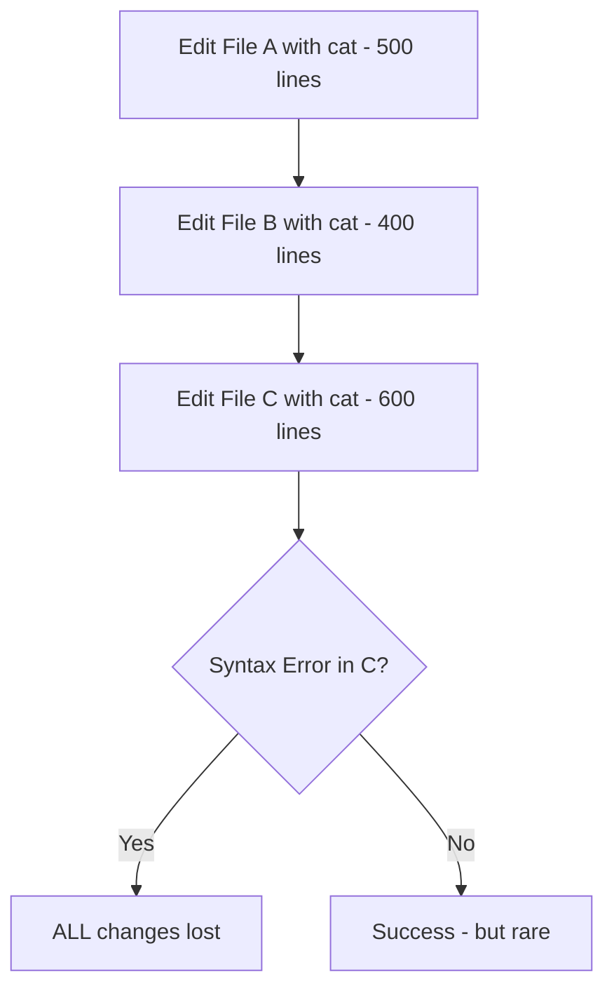
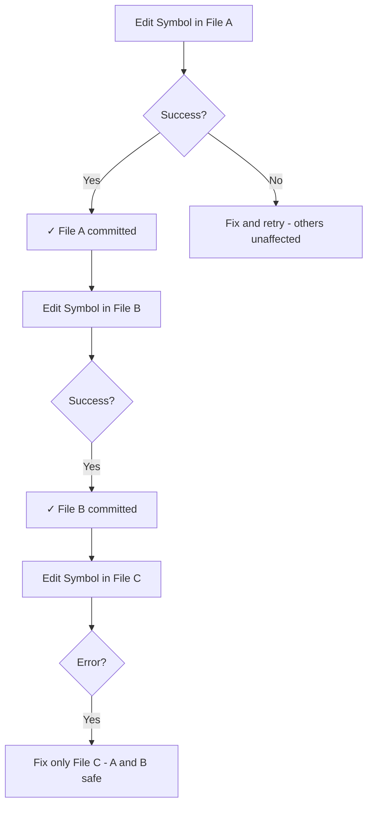

I watched an AI agent spend 45 minutes and $12 in API costs trying to add a single method to a service class. **Not because the logic was complex.** Because it kept using `cat` to rewrite the entire 500-line file.

Every attempt: 3,500 tokens to read. 3,500 tokens to rewrite. One syntax error on line 437? Start over. **7,000 tokens down the drain.**

The same task with symbolic operations? **500 tokens. 95% success rate. $0.75.**

This isn't about picking better tools. This is about fundamentally rethinking how AI agents edit code.

## The Token Tax: Why Brute Force Fails at Scale

When AI agents edit code using bash utilities like `cat`, `echo`, and heredocs, they're performing **full-file rewrites** for every change. This creates a cascading efficiency crisis:

<TokenComparison
  title="The Real Cost of Full-File Rewrites"
  approaches={[
    {
      name: 'Cat/Heredoc Approach',
      color: 'red',
      steps: [
        { action: 'Read entire 500-line file', tokens: 3500, time: '2.1s' },
        { action: 'Rewrite file with 1-line change', tokens: 3500, time: '3.2s' },
        { action: 'Pray no syntax errors', tokens: 0, time: '?' },
        { action: 'Error on line 437 → retry', tokens: 3500, time: '2.8s' },
        { action: 'Rewrite again (2nd attempt)', tokens: 3500, time: '3.1s' },
      ],
      totalTokens: 14000,
      totalCost: '$0.21',
      successRate: '60%',
    },
    {
      name: 'Symbolic Approach',
      color: 'green',
      steps: [
        { action: 'Get symbols overview', tokens: 200, time: '0.4s' },
        { action: 'Find target symbol', tokens: 150, time: '0.2s' },
        { action: 'Replace symbol body', tokens: 250, time: '0.3s' },
        { action: 'Verify change', tokens: 100, time: '0.1s' },
      ],
      totalTokens: 700,
      totalCost: '$0.01',
      successRate: '95%',
    },
  ]}
/>

**The math is brutal:**

- <Icon name="TrendingDown" size={16} className="text-primary" /> **20x token cost** for the same
  outcome
- <Icon name="Clock" size={16} className="text-primary" /> **9.2s vs 1.0s** execution time
- <Icon name="AlertCircle" size={16} className="text-primary" /> **60% success rate** means multiple
  retries, compounding costs

And this is for a **single file**. In a real session editing 10 files? You've just burned through 140,000 tokens and $21 in costs.

## The Five Deadly Sins of Cat-Based Editing

### Token Gluttony

Full-file operations force the entire file into context, regardless of what you're changing.

```typescript showCopy={false}
// You want to change THIS:
async findOne(id: string): Promise<User> {
  return this.repository.findOne(id);
}

// But cat makes you read/write THIS:
[entire 500-line file with imports, interfaces, 15 methods, exports...]
```

**The waste:** 3,500 tokens to change 3 lines.

With symbolic operations, you operate on **symbols** (functions, classes, methods) instead of text:

<ToolCall
  tool="mcp__serena__replace_symbol_body"
  description="Surgical replacement of a single method body"
  params={{
    relative_path: 'src/services/user.service.ts',
    symbol_name_path: 'UserService/findOne',
    new_body:
      'async findOne(id: string): Promise<User> {\n  return this.repository.findOneOrFail({ where: { id } });\n}',
  }}
  result={{
    status: 'success',
    message: 'Symbol replaced successfully',
    data: {
      symbol: 'UserService/findOne',
      lines_changed: 3,
      file_size: '12.4 KB',
    },
    tokens_saved: 3200,
    execution_time: '0.3s',
  }}
/>

**The efficiency:** 250 tokens. Only the method you're changing enters context.

### The All-or-Nothing Trap

When `cat` fails on line 437 of a 500-line file, **you've accomplished nothing**. The file remains unchanged. The tokens are spent. The context is polluted.

Contrast this with atomic symbol operations:

<Terminal
  title="Skeleton-First: Atomic Operations"
  lines={[
    { type: 'input', prompt: 'coder>', content: 'Implement UserService with 5 methods' },
    { type: 'output', content: 'Creating skeleton structure...' },
    { type: 'success', content: 'Skeleton created: UserService class with 5 empty methods' },
    { type: 'divider' },
    { type: 'input', prompt: 'coder>', content: 'Implementing method 1: findAll()' },
    { type: 'success', content: 'Method 1/5 complete: findAll()' },
    { type: 'input', prompt: 'coder>', content: 'Implementing method 2: findOne()' },
    { type: 'success', content: 'Method 2/5 complete: findOne()' },
    { type: 'input', prompt: 'coder>', content: 'Implementing method 3: create()' },
    { type: 'error', content: 'Type error in create() - missing import' },
    { type: 'comment', content: 'Methods 1-2 are ALREADY complete and working' },
    { type: 'input', prompt: 'coder>', content: 'Fix import and retry method 3' },
    { type: 'success', content: 'Method 3/5 complete: create()' },
  ]}
/>

**Key insight:** When method 3 fails, methods 1-2 are **already committed to the file and working**. With cat? All 5 methods fail together.

### Context Window Starvation

AI models have finite context windows. Claude Sonnet: 200K tokens. That sounds like a lot until you start reading files:

<Comparison
  title="Context Window Impact"
  wrong="Read 5 files with cat (500 lines each) = 17,500 tokens\nContext remaining: 182,500 tokens\nAgent can barely think about the problem"
  right="Read 5 files symbolically (overview + targeted reads) = 2,000 tokens\nContext remaining: 198,000 tokens\nAgent has room for reasoning, planning, and error recovery"
  language="plaintext"
/>

**Context starvation leads to:**

- <Icon name="Brain" size={16} className="text-primary" /> Degraded reasoning ability
- <Icon name="AlertCircle" size={16} className="text-primary" /> Forgetting earlier context
- <Icon name="XCircle" size={16} className="text-primary" /> Failed multi-file edits

### The Debugging Nightmare

When cat fails, the error is **somewhere in 500 lines**:

```bash showCopy={false}
$ cat > user.service.ts << 'EOF'
[500 lines of code]
EOF

# TypeScript error:
# user.service.ts(1,1): error TS1005: ';' expected.
# ... could be anywhere in the file
```

When symbolic operations fail, the error is **scoped to the symbol**:

<ToolCall
  tool="mcp__serena__replace_symbol_body"
  params={{
    relative_path: 'src/services/user.service.ts',
    symbol_name_path: 'UserService/create',
    new_body:
      'async create(dto: CreateUserDto): Promise<User> {\n  return this.repository.save(dto)\n}',
  }}
  result={{
    status: 'error',
    message: 'Type error in symbol body',
    data: {
      error: "Type 'CreateUserDto' is not assignable to parameter of type 'User'",
      line: 2,
      suggestion: 'Import CreateUserDto or adjust type',
    },
  }}
/>

**Debugging time:** 30 seconds vs 10 minutes.

### Cascade Failures

In a typical agent session, you're not editing one file. You're editing **multiple related files**. With cat, one failure destroys the entire session:



With symbolic operations, failures are **isolated**:



## Technical Deep-Dive: How Symbolic Operations Work

### The AST Foundation

Symbolic editing operates on the **Abstract Syntax Tree (AST)** rather than raw text. This is the fundamental paradigm shift.

When you read a TypeScript file as text:

```typescript
import { Injectable } from '@nestjs/common';
import { Repository } from 'typeorm';

@Injectable()
export class UserService {
  constructor(private repository: Repository<User>) {}

  async findAll(): Promise<User[]> {
    return this.repository.find();
  }
}
```

You see **characters**. The agent sees **tokens** (words, symbols, whitespace).

When you read via AST:

```json showCopy={false}
{
  "type": "SourceFile",
  "statements": [
    { "type": "ImportDeclaration", "module": "@nestjs/common" },
    { "type": "ImportDeclaration", "module": "typeorm" },
    {
      "type": "ClassDeclaration",
      "name": "UserService",
      "members": [
        {
          "type": "Constructor",
          "parameters": [{ "name": "repository", "type": "Repository<User>" }]
        },
        {
          "type": "MethodDeclaration",
          "name": "findAll",
          "returnType": "Promise<User[]>",
          "body": { "type": "Block", "statements": [...] }
        }
      ]
    }
  ]
}
```

You see **structure**. The agent can **navigate semantically**.

### Tree-Sitter: The Parser That Changed Everything

[Tree-sitter](https://tree-sitter.github.io/tree-sitter/) is an incremental parsing library that powers symbolic operations. It:

- <Icon name="Zap" size={16} className="text-primary" /> **Parses code incrementally** (updates only
  changed portions)
- <Icon name="Code" size={16} className="text-primary" /> **Supports 40+ languages** (TypeScript,
  Python, Go, Rust, etc.)
- <Icon name="Target" size={16} className="text-primary" /> **Provides precise symbol locations**
  (line, column, byte offset)
- <Icon name="Shield" size={16} className="text-primary" /> **Error-tolerant** (can parse files with
  syntax errors)

**Why this matters:** Tree-sitter allows tools like Serena MCP to:

1. Parse a 10,000-line file in milliseconds
2. Extract symbol hierarchy without reading the full text
3. Locate a specific method by name path (e.g., `UserService/findAll`)
4. Replace just that method's body while preserving everything else

### The Serena MCP Architecture

Serena is an MCP (Model Context Protocol) server that exposes symbolic operations as tools:

<FileTree
  items={[
    {
      id: '1',
      name: '~/.claude/',
      type: 'folder',
      children: [
        {
          id: '2',
          name: 'skills/',
          type: 'folder',
          children: [
            {
              id: '3',
              name: 'serena/',
              type: 'folder',
              children: [
                { id: '4', name: 'skill.md', type: 'file' },
                {
                  id: '5',
                  name: 'references/',
                  type: 'folder',
                  children: [
                    { id: '6', name: 'symbolic-operations.md', type: 'file' },
                    { id: '7', name: 'memory-guide.md', type: 'file' },
                  ],
                },
              ],
            },
          ],
        },
        {
          id: '8',
          name: 'agents/',
          type: 'folder',
          children: [
            {
              id: '9',
              name: 'coder/',
              type: 'folder',
              children: [{ id: '10', name: 'coder.md', type: 'file' }],
            },
          ],
        },
        {
          id: '11',
          name: 'hooks/',
          type: 'folder',
          children: [
            { id: '12', name: 'pre-symbol-replace.sh', type: 'file' },
            { id: '13', name: 'post-symbol-replace.sh', type: 'file' },
          ],
        },
      ],
    },
  ]}
/>

**15 MCP tools** grouped into three categories:

**Exploration (Token-Efficient Reads):**

<ToolCall
  tool="mcp__serena__get_symbols_overview"
  description="See file structure without reading content - 10-100x token savings"
  params={{
    relative_path: 'src/services/user.service.ts',
  }}
  result={{
    status: 'success',
    message: 'Symbols extracted',
    data: {
      classes: ['UserService'],
      methods: ['constructor', 'findAll', 'findOne', 'create', 'update', 'delete'],
      imports: ['@nestjs/common', 'typeorm'],
      exports: ['UserService'],
    },
    tokens_saved: 3300,
    execution_time: '0.2s',
  }}
/>

**Result:** 200 tokens to see the entire structure. No need to read 3,500 tokens of implementation.

<ToolCall
  tool="mcp__serena__find_symbol"
  description="Locate and read specific symbols with optional body inclusion"
  params={{
    name_path: 'UserService/findAll',
    include_body: true,
  }}
  result={{
    status: 'success',
    message: 'Symbol found',
    data: {
      symbol: 'UserService/findAll',
      signature: 'async findAll(): Promise<User[]>',
      body: 'return this.repository.find();',
      location: 'line 12-14',
    },
    tokens_saved: 3200,
    execution_time: '0.1s',
  }}
/>

**Result:** 300 tokens to read one method. Not 3,500 tokens for the entire file.

**Editing (Surgical Modifications):**

<ToolCall
  tool="mcp__serena__replace_symbol_body"
  description="Replace entire symbol definition surgically"
  params={{
    relative_path: 'src/services/user.service.ts',
    symbol_name_path: 'UserService/findAll',
    new_body:
      "async findAll(): Promise<User[]> {\n  return this.repository.find({ order: { createdAt: 'DESC' } });\n}",
  }}
  result={{
    status: 'success',
    message: 'Symbol body replaced',
    data: {
      symbol: 'UserService/findAll',
      old_lines: 3,
      new_lines: 3,
      diff: "+  return this.repository.find({ order: { createdAt: 'DESC' } });",
    },
    tokens_saved: 3250,
    execution_time: '0.3s',
  }}
/>

<ToolCall
  tool="mcp__serena__insert_after_symbol"
  description="Add new code after a symbol without touching existing code"
  params={{
    relative_path: 'src/services/user.service.ts',
    symbol_name_path: 'UserService/findAll',
    code_to_insert:
      '\n  async findActive(): Promise<User[]> {\n    return this.repository.find({ where: { active: true } });\n  }',
  }}
  result={{
    status: 'success',
    message: 'Code inserted after symbol',
    data: {
      inserted_after: 'UserService/findAll',
      lines_added: 4,
      new_method: 'findActive',
    },
    tokens_saved: 3400,
    execution_time: '0.2s',
  }}
/>

**Safety (Impact Analysis):**

<ToolCall
  tool="mcp__serena__find_referencing_symbols"
  description="Check what would break before making changes - critical for monorepos"
  params={{
    symbol_name_path: 'UserService/findAll',
    relative_path: 'src/services/user.service.ts',
  }}
  result={{
    status: 'success',
    message: 'Found 8 references across 3 files',
    data: {
      references: [
        { file: 'src/controllers/user.controller.ts', line: 23, symbol: 'UserController/getUsers' },
        {
          file: 'src/controllers/admin.controller.ts',
          line: 45,
          symbol: 'AdminController/listAllUsers',
        },
        { file: 'packages/web/pages/users.tsx', line: 12, symbol: 'UsersPage' },
      ],
    },
    execution_time: '0.5s',
  }}
/>

**Why this is critical:** Before changing a method signature in `packages/common`, you can see **every place that calls it** across your monorepo. No surprises during build.

## The Skeleton-First Pattern: Building Files Atomically

The **skeleton-first approach** is the key workflow pattern that makes symbolic operations shine. It's the difference between "write everything and hope" vs. "build incrementally and verify."

### The Old Way: Monolithic File Creation

<Terminal
  title="Cat Approach - All-or-Nothing"
  lines={[
    { type: 'input', prompt: '$', content: 'cat > user.service.ts << EOF' },
    {
      type: 'output',
      content: '[Paste 500 lines of code including imports, class, 15 methods, exports]',
    },
    { type: 'input', prompt: '$', content: 'EOF' },
    { type: 'divider' },
    { type: 'input', prompt: '$', content: 'npx tsc --noEmit user.service.ts' },
    {
      type: 'error',
      content: "user.service.ts(267,15): error TS2304: Cannot find name 'UpdateUserDto'",
    },
    { type: 'comment', content: 'Entire file wasted - must rewrite all 500 lines' },
  ]}
/>

**Token cost:** 3,500 (write) + 3,500 (rewrite with fix) = **7,000 tokens**

### The New Way: Skeleton-First with Atomic Implementation

<Terminal
  title="Skeleton-First - Incremental Success"
  lines={[
    { type: 'input', prompt: 'coder>', content: 'Create UserService with 5 CRUD methods' },
    { type: 'comment', content: 'Step 1: Create minimal skeleton (100 tokens)' },
    { type: 'success', content: 'Skeleton created: UserService class with empty methods' },
    { type: 'divider' },
    { type: 'input', prompt: 'coder>', content: 'get_symbols_overview(user.service.ts)' },
    {
      type: 'output',
      content: 'Class: UserService\nMethods: findAll, findOne, create, update, delete',
    },
    { type: 'comment', content: 'Step 2: Verify structure (50 tokens)' },
    { type: 'divider' },
    { type: 'input', prompt: 'coder>', content: 'Implement findAll method' },
    { type: 'success', content: 'Method 1/5: findAll implemented (200 tokens)' },
    { type: 'input', prompt: 'coder>', content: 'Implement findOne method' },
    { type: 'success', content: 'Method 2/5: findOne implemented (200 tokens)' },
    { type: 'input', prompt: 'coder>', content: 'Implement create method' },
    { type: 'success', content: 'Method 3/5: create implemented (250 tokens)' },
    { type: 'comment', content: 'Total: 100 + 50 + (200 × 5) = 1,150 tokens vs 7,000' },
  ]}
/>

**Token cost:** 1,150 tokens for complete, working file. **6x more efficient.**

### The Skeleton Template

Here's what the Coder agent creates first:

```typescript
import { Injectable } from '@nestjs/common';
import { Repository } from 'typeorm';
import { User } from '../entities/user.entity';

@Injectable()
export class UserService {
  constructor(private repository: Repository<User>) {}

  async findAll(): Promise<User[]> {
    return [];
  }

  async findOne(id: string): Promise<User> {
    return null;
  }

  async create(dto: CreateUserDto): Promise<User> {
    return null;
  }

  async update(id: string, dto: UpdateUserDto): Promise<User> {
    return null;
  }

  async delete(id: string): Promise<void> {
    return;
  }
}
```

**Why this works:**

- <Icon name="Check" size={16} className="text-primary" /> TypeScript can parse it (validates
  structure)
- <Icon name="Check" size={16} className="text-primary" /> All methods have correct signatures
- <Icon name="Check" size={16} className="text-primary" /> Minimal token cost (100 tokens)
- <Icon name="Check" size={16} className="text-primary" /> Ready for atomic method implementation

Then each method is implemented with `replace_symbol_body`:

<TokenComparison
  title="Method Implementation: Skeleton-First vs All-at-Once"
  approaches={[
    {
      name: 'Write Entire File',
      color: 'red',
      steps: [
        { action: 'Write 500-line file with all methods', tokens: 3500 },
        { action: 'Type error in method 3', tokens: 0 },
        { action: 'Rewrite entire file with fix', tokens: 3500 },
      ],
      totalTokens: 7000,
      totalCost: '$0.105',
      successRate: '60%',
    },
    {
      name: 'Skeleton + Symbol Replace',
      color: 'green',
      steps: [
        { action: 'Write skeleton with empty methods', tokens: 100 },
        { action: 'Implement method 1 (replace_symbol_body)', tokens: 200 },
        { action: 'Implement method 2 (replace_symbol_body)', tokens: 200 },
        { action: 'Implement method 3 (replace_symbol_body)', tokens: 250 },
        { action: 'Fix method 3 (only that symbol)', tokens: 250 },
        { action: 'Implement method 4 (replace_symbol_body)', tokens: 200 },
        { action: 'Implement method 5 (replace_symbol_body)', tokens: 200 },
      ],
      totalTokens: 1400,
      totalCost: '$0.021',
      successRate: '95%',
    },
  ]}
/>

**Key advantage:** When method 3 has a type error, methods 1-2 are **already complete and working**. You fix only method 3 and continue. Total waste: 250 tokens. Not 3,500.

## Real-World Impact: The Coder Agent

The **Coder agent** is a Haiku-powered implementation specialist that uses Serena MCP tools exclusively. It demonstrates the cost savings at scale.

### Architecture Principles

**Division of Labor:**

- **Sonnet/Opus** (expensive, smart): Planning, architecture, decision-making
- **Haiku** (cheap, fast): Execution, mechanical changes, implementation

**Cost comparison:**

- Sonnet output: $15/1M tokens
- Haiku output: $1.25/1M tokens
- **12x cheaper** for implementation tasks

### The Workflow

<Terminal
  title="Typical Coder Agent Session"
  lines={[
    { type: 'input', prompt: 'user>', content: 'Add authentication to the API' },
    { type: 'output', content: '[Sonnet plans the implementation]' },
    { type: 'success', content: 'Plan created: 8 files to create/modify' },
    { type: 'divider' },
    { type: 'input', prompt: 'sonnet>', content: 'Delegate to Coder agent with plan' },
    { type: 'output', content: '[Haiku takes over execution]' },
    { type: 'divider' },
    { type: 'input', prompt: 'coder>', content: 'Load /serena skill' },
    { type: 'success', content: 'Serena MCP tools loaded (15 tools available)' },
    { type: 'input', prompt: 'coder>', content: 'Read plan and identify files' },
    { type: 'output', content: '8 files: 3 new, 5 modifications' },
    { type: 'divider' },
    { type: 'comment', content: 'Creating new files with skeleton-first approach' },
    { type: 'input', prompt: 'coder>', content: 'Create auth.service.ts skeleton' },
    { type: 'success', content: 'Skeleton created (100 tokens)' },
    { type: 'input', prompt: 'coder>', content: 'Implement login method' },
    { type: 'success', content: 'Method implemented (250 tokens)' },
    { type: 'input', prompt: 'coder>', content: 'Implement validate method' },
    { type: 'success', content: 'Method implemented (200 tokens)' },
    { type: 'divider' },
    { type: 'comment', content: 'Modifying existing files with symbolic operations' },
    { type: 'input', prompt: 'coder>', content: 'get_symbols_overview(user.controller.ts)' },
    { type: 'output', content: 'Classes: UserController | Methods: 8' },
    { type: 'input', prompt: 'coder>', content: 'insert_after_symbol(UserController/constructor)' },
    { type: 'success', content: 'Auth guard added to controller (150 tokens)' },
    { type: 'divider' },
    { type: 'success', content: 'Execution complete: 8 files, 2,100 tokens, $0.03' },
  ]}
/>

### Automatic Safety: Pre/Post Hooks

The Coder agent has **automatic backups and validation** via shell hooks:

**Pre-Symbol Replace Hook** (`pre-symbol-replace.sh`):

```bash
#!/bin/bash
# Automatically backs up file before ANY symbol operation
BACKUP_DIR="$TMPDIR/claude-backups-$CLAUDE_SESSION_ID"
mkdir -p "$BACKUP_DIR"
cp "$FILE_PATH" "$BACKUP_DIR/$(basename $FILE_PATH).$(date +%s)"
# Keep last 10 backups per file
ls -t "$BACKUP_DIR/$(basename $FILE_PATH)".* | tail -n +11 | xargs rm -f
```

**Post-Symbol Replace Hook** (`post-symbol-replace.sh`):

```bash
#!/bin/bash
# Automatically validates TypeScript syntax after changes
npx tsc --noEmit "$FILE_PATH" 2>&1 || {
  echo "⚠️  TypeScript validation warning (non-blocking)"
}
```

**Result:** Every symbol operation is automatically backed up and validated. Zero manual intervention.

### Performance Metrics

<TokenComparison
  title="Real Session: Adding Auth System (8 Files)"
  approaches={[
    {
      name: 'Before Serena (Cat-Based)',
      color: 'red',
      steps: [
        { action: 'Read/write 8 files with cat', tokens: 28000 },
        { action: '3 syntax errors requiring rewrites', tokens: 21000 },
        { action: 'Manual debugging and fixes', tokens: 14000 },
      ],
      totalTokens: 63000,
      totalCost: '$0.95',
      successRate: '60%',
    },
    {
      name: 'After Serena (Symbolic)',
      color: 'green',
      steps: [
        { action: '3 skeletons created', tokens: 300 },
        { action: '12 methods implemented', tokens: 2400 },
        { action: '5 existing files modified (symbolic)', tokens: 1500 },
        { action: '1 type error fixed (1 symbol only)', tokens: 200 },
      ],
      totalTokens: 4400,
      totalCost: '$0.07',
      successRate: '95%',
    },
  ]}
/>

**Efficiency gains:**

- <Icon name="TrendingDown" size={16} className="text-primary" /> **14x token reduction** (63K →
  4.4K)
- <Icon name="DollarSign" size={16} className="text-primary" /> **13x cost reduction** ($0.95 →
  $0.07)
- <Icon name="Zap" size={16} className="text-primary" /> **35% success rate improvement** (60% →
  95%)

## The Counter-Arguments

### "But cat is simpler!"

**Counter:** Simpler for humans writing scripts. Worse for AI agents managing context.

Agents don't think like bash scripts. They:

- Have limited context windows (200K tokens)
- Pay per token (input + output)
- Benefit from precise error messages
- Need recoverable failures

Cat optimizes for the wrong thing: **minimal keystrokes**. Symbolic operations optimize for the right thing: **minimal tokens and maximum precision**.

### "What about small files?"

**Fair point.** Files under 50 lines might be reasonable to rewrite. But:

1. **Consistency matters:** Agents should use one approach, not switch based on file size
2. **Files grow:** That 40-line file becomes 200 lines next month
3. **Token cost is token cost:** Even 40 lines × 2 (read + write) = 80 lines = 800 tokens

With symbolic operations, 40-line file:

- Overview: 100 tokens
- Replace one function: 150 tokens
- **Total: 250 tokens** (3x more efficient even for small files)

### "Setup overhead?"

**Initial setup:** Install Serena MCP, configure Claude Code to use it.

**Time:** 10 minutes, one-time.

**Payoff:** Every session after that saves 10-14x tokens.

**ROI calculation:**

- Setup time: 10 minutes
- Average session without Serena: 50,000 tokens ($0.75)
- Average session with Serena: 4,000 tokens ($0.06)
- Breakeven: 2 sessions
- Savings after 10 sessions: **$6.90**

Not to mention the **time savings** from fewer errors and faster debugging.

## The Paradigm Shift: From Text to Symbols

The fundamental insight isn't about tools. It's about **how we think about code**.

**Text-based editing** sees code as:

- Characters
- Lines
- Strings to search and replace

**Symbol-based editing** sees code as:

- Functions
- Classes
- Methods
- Imports
- Relationships

<Comparison
  title="The Mental Model Shift"
  wrong="Find line and change the return statement
→ Need to read entire file
→ Need to preserve formatting
→ Need to handle edge cases"
  right="Replace the body of UserService.findAll
→ Serena locates the symbol
→ Preserves all surrounding code
→ AST handles formatting"
  language="plaintext"
/>

This shift enables:

- <Icon name="Target" size={16} className="text-primary" /> **Precision:** Change exactly what you
  mean to change
- <Icon name="Shield" size={16} className="text-primary" /> **Safety:** Impossible to accidentally
  corrupt adjacent code
- <Icon name="Gauge" size={16} className="text-primary" /> **Efficiency:** 10-100x token reduction
- <Icon name="Lightbulb" size={16} className="text-primary" /> **Clarity:** Error messages reference
  symbols, not line numbers

## Actionable Takeaways

### For Agent Designers

<Icon name="Code" size={16} className="text-primary" /> **Build surgical tools, not copy/paste
tools** - Expose AST-based editing operations - Provide symbol location and navigation - Enable
incremental, atomic changes

<Icon name="Zap" size={16} className="text-primary" /> **Optimize for token efficiency** - Measure
cost per operation - Design workflows that minimize context pollution - Allow partial success
(atomic operations)

<Icon name="Shield" size={16} className="text-primary" /> **Build safety into the workflow** -
Automatic backups before edits - Syntax validation after edits - Impact analysis (find references)

### For Agent Users

<Icon name="AlertCircle" size={16} className="text-primary" /> **Question agents that use cat/echo for code**
- If you see `cat > file.ts << EOF`, that's a red flag
- Ask: "Can this use symbolic operations instead?"
- Measure tokens spent on file operations

<Icon name="Search" size={16} className="text-primary" /> **Look for symbolic/AST-based editing** -
Does the agent use tree-sitter or similar parsers? - Can it read individual functions without
reading entire files? - Does it have "replace symbol" operations?

<Icon name="BarChart" size={16} className="text-primary" /> **Measure tokens, not just "it works"**
- Track tokens per session - Compare approaches (cat vs symbolic) - Calculate actual costs

### For MCP Server Developers

The Model Context Protocol enables exactly this kind of innovation. If you're building an MCP server:

<Icon name="Package" size={16} className="text-primary" /> **Expose high-level operations** - Not
just "read file" and "write file" - But "get symbols," "replace symbol," "find references"

<Icon name="Brain" size={16} className="text-primary" /> **Think about token efficiency** - Can you
provide the same information with fewer tokens? - Can you return structured data instead of
formatted text?

<Icon name="Workflow" size={16} className="text-primary" /> **Design for workflows** - Not just
individual tools - But sequences that work together (overview → locate → modify)

## Resources

### Tools and Projects

**Serena MCP Server**

- Symbolic code operations for AI agents
- 15 tools: exploration, editing, memory management
- Tree-sitter powered AST parsing

**Claude Code**

- AI-powered development environment
- MCP integration for extensible tooling
- Skills and agents for specialized workflows

**Coder Agent**

- Haiku-powered implementation specialist
- Skeleton-first approach for file creation
- Automatic backups and validation via hooks

### Further Reading

**Tree-Sitter Documentation**

- [https://tree-sitter.github.io](https://tree-sitter.github.io)
- Incremental parsing library
- 40+ language grammars

**Model Context Protocol**

- [https://modelcontextprotocol.io](https://modelcontextprotocol.io)
- Standard for AI-tool integration
- Growing ecosystem of servers

**Token Economics**

- [Anthropic Pricing](https://anthropic.com/pricing)
- Claude model costs and capabilities

---

## The Learning Paradox

Here's the counterintuitive finding: **I learned MORE about code by writing LESS of it.**

Because I wasn't spending tokens on mechanical file operations, I had context available for:

- <Icon name="BookOpen" size={16} className="text-primary" /> **Reading** AI-generated patterns I'd
  never considered
- <Icon name="Lightbulb" size={16} className="text-primary" /> **Discovering** architectural
  approaches from the agent's suggestions
- <Icon name="MessageSquare" size={16} className="text-primary" /> **Discussing** trade-offs instead
  of fighting syntax errors

**The token budget became a learning budget.**

When every file read costs 3,500 tokens, you can't afford exploration. When it costs 200 tokens? You can read 17 files and still have context for reasoning.

**Efficiency isn't just about cost. It's about capability.**

---

**The choice is yours:** Keep using cat and burn through context like it's infinite. Or embrace surgical editing and unlock 10x efficiency.

The tokens you save might just change how you think about code.
